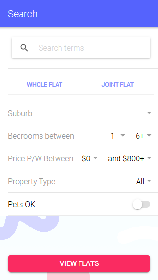
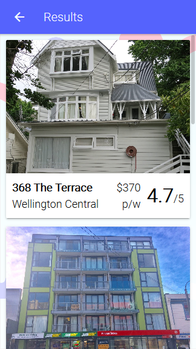
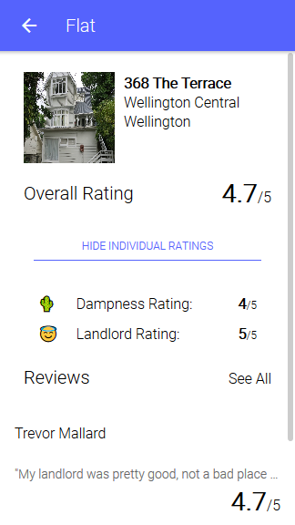

# FlatFive

Repo for Summer of Tech's Create Camp 2018, where our team came up with a solution for tenants to share their flatting experiences with others through our app, Flat Five.

## Background

It is often hard for tenants to find out about firsthand experiences with flats since information is often conveyed across platforms that are not necessarily suited for it (e.g. Facebook groups.) These "reviews" are also often not consolidated such that one flat can be linked with several experiences.

## What we came up with

We developed a mobile app that allows users to rate flats and leave reviews with a global rate-out-of-5 system. App scores are averaged from all their individual ratings. Users may also search for flats with respect to these values (i.e. filtering and sorting) and locate flats on integrated maps.

The app uses Trade Me's API to pull data about flats and merge it with crowd-sourced datasets as populated by reviews and ratings. The version hosted in this repo was produced in 16 hours and is able to search for flats and store review information inputted in a Firebase realtime database. The app itself is implemented using the Ionic framework.

You can use it here: [markmetcalfe.io/flatfive](https://markmetcalfe.io/flatfive)

## The Team

**DESIGNERS**
- Rachel Bolt

**DEVELOPERS**
- [Mark Metcalfe](https://github.com/markmetcalfe)
- [Geordie Rogers](https://github.com/GeordieR)
- [Liam Byrne](https://github.com/byrneliam2)
- [Rodney Cruden-Powell](https://github.com/StragglyRodney)

## Screenshots

